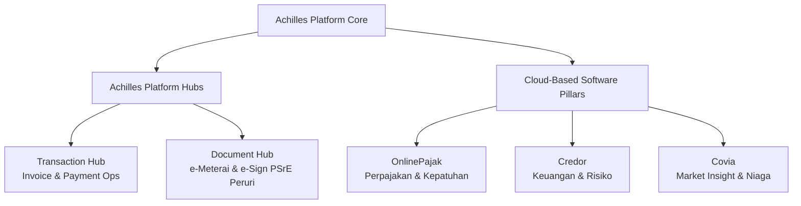

# Achilles Platform Overview

> **Parent Platform**: Achilles ([achilles.id](https://achilles.id))  
> **Official Tagline**: *Ekosistem Software Bisnis Terintegrasi Indonesia*  
> **Scale & Trust**: Dipercaya oleh 150.000+ bisnis di Indonesia. Tersertifikasi ISO 27001, mitra resmi DJP, terdaftar & diawasi Bank Indonesia, terdaftar sebagai PSE Komdigi, dan PSrE tersertifikasi Peruri.

---

## 1. Ekosistem Achilles

Achilles menggabungkan seluruh alur transaksi, kepatuhan legal/pajak, pembiayaan modal kerja, dan intelijen pasar ke dalam satu sistem terintegrasi:

### 3 Solusi Software Utama (Dedicated Business Contexts):

1. **[OnlinePajak](units/onlinepajak.md)**: Platform kepatuhan perpajakan (e-Faktur, e-Bupot, hitung, bayar, lapor SPT) sebagai PJAP resmi mitra DJP & BI.
2. **[Credor](units/credor.md)**: Akses pembiayaan bisnis (invoice financing, working capital) dan penilaian profil risiko kredit mitra berbasis AI.
3. **[Covia](units/covia.md)**: Market intelligence pergerakan harga bahan baku/komoditas regional dan visibilitas distribusi di seluruh Indonesia.

### 2 Platform Hub Pendukung:
- **Transaction Hub**: Pembuatan, pengiriman invoice komersial, rekonsiliasi, hingga penerimaan pembayaran terotomatisasi.
- **Document Hub**: Pengelolaan dokumen digital legal dengan tanda tangan digital (*e-Signature*) dan meterai elektronik (*e-Meterai*) resmi bersertifikasi Peruri.

---

## 2. Alur Integrasi Lintas Produk (Interconnected Flows)

Kekuatan utama ekosistem Achilles adalah integrasi mulus tanpa input manual berulang:

1. **Invoice ke Pajak**: Invoice yang diterbitkan di *Transaction Hub* dapat langsung di-generate menjadi e-Faktur di *OnlinePajak*.
2. **Transaksi ke Pembiayaan**: Riwayat invoice yang terverifikasi dapat diajukan sebagai jaminan pembiayaan modal kerja di *Credor*.
3. **Legalitas Digital**: Perjanjian pembiayaan Credor atau kontrak jual-beli disahkan secara sah di mata hukum melalui *Document Hub* (e-Meterai & e-Signature Peruri).
4. **Data Pasar ke Penetapan Harga**: Data indeks harga dari *Covia* menjadi dasar penetapan harga invoice di *Transaction Hub*.

---

## 3. Aturan Umum untuk AI Agent

- **Satu Ekosistem, Identitas Jelas**: Saat membuat UI untuk salah satu pilar (OnlinePajak, Credor, atau Covia), selalu periksa file konteks masing-masing untuk terminologi dan batasan hukum.
- **Jangan Menggabungkan Terminologi Secara Acak**: Istilah perpajakan di OnlinePajak (seperti *Lapor SPT*, *NTPN*, *ID Billing*) tidak boleh tercampur dengan istilah pinjaman di Credor (*Pencairan*, *Tenor*, *Skor Risiko*).
- **Kepatuhan & Sertifikasi**: Hanya tampilkan logo/sertifikasi yang relevan dengan pilar yang sedang dibangun (misal: DJP & BI untuk OnlinePajak; Peruri & Komdigi untuk Document Hub; OJK partner untuk Credor).
