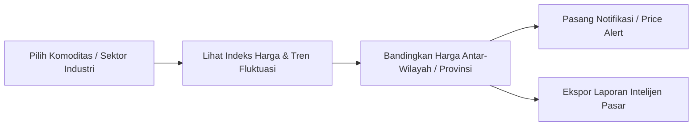

# Business Context: Covia

> **Unit**: Market Insight & Niaga (Business & Market Intelligence)  
> **Parent Platform**: Achilles ([achilles.id](https://achilles.id))  
> **Target Audience**: Procurement Managers, Supply Chain Directors, Commodity Traders, Commercial Strategists, Enterprise Sourcing Teams.

---

## 1. Product Purpose & Value Proposition
Covia adalah platform *market intelligence* dan data niaga yang menyediakan wawasan mendalam mengenai pergerakan harga komoditas/bahan baku, visibilitas jalur distribusi, serta daya saing harga antar-wilayah di seluruh Indonesia secara *real-time*. Covia memberdayakan bisnis untuk mengoptimalkan biaya pengadaan, menentukan harga jual yang kompetitif, dan memitigasi volatilitas pasar.

---

## 2. Core Personas

| Persona | Primary Goal | Critical Constraints |
| :--- | :--- | :--- |
| **Procurement & Sourcing Manager** | Mendapatkan harga bahan baku terbaik dan posisi tawar yang kuat dalam negosiasi vendor | Membutuhkan tren historis harga, perbandingan antar-wilayah (disparitas harga), dan satuan metrik baku (kg/ton). |
| **Supply Chain & Distribution Director** | Memetakan potensi pasar baru dan mengoptimalkan rute pasokan berdasarkan perbedaan harga regional | Memerlukan visualisasi peta distribusi, biaya logistik komparatif, dan visibilitas stok regional. |
| **Business Strategist / Commercial Lead** | Memproyeksikan margin keuntungan dan menetapkan strategi penetapan harga (*pricing strategy*) yang dinamis | Membutuhkan data indeks harga tepercaya (*Price Index*) yang dapat diintegrasikan dengan proyeksi keuangan internal. |

---

## 3. Core Flows

1. **Pemantauan Indeks Harga Komoditas (Price Index Tracker)**:
   - Pencarian komoditas (misal: beras, gula, minyak sawit, bahan kimia, material industri).
   - Filter rentang waktu (7 hari, 30 hari, 1 tahun, YTD).
   - Grafik tren harga (harga tertinggi, terendah, dan rerata nasional/regional).

2. **Analisis Daya Saing & Disparitas Regional (Regional Price Benchmark)**:
   - Visualisasi peta interaktif harga per provinsi atau kota sentra industri di Indonesia.
   - Perhitungan persentase selisih harga (disparitas) antar sentra produksi vs sentra konsumsi.

3. **Peringatan Volatilitas Pasar (Price Alert & Digest)**:
   - Pengaturan threshold notifikasi jika harga komoditas naik/turun di atas ambang batas (misal: $\pm 5\%$).
   - Pengiriman digest mingguan tren pasar ke email pengambil keputusan.

---

## 4. UI Copy, Terminology & Action Verbs

| Gunakan (Approved) | Jangan Gunakan (Forbidden) | Konteks |
| :--- | :--- | :--- |
| **Indeks Harga** | Daftar Harga Murah | Nilai benchmark komoditas pasar |
| **Rerata Nasional** | Harga Rata-rata Biasa | Acuan harga agregrat seluruh Indonesia |
| **Disparitas Harga** | Selisih Untung | Perbedaan harga antar daerah/wilayah |
| **Tren Pergerakan** | Naik Turun | Grafik fluktuasi waktu ke waktu |
| **Pasang Peringatan Harga** | Ingatkan Saya | CTA untuk membuat price alert threshold |
| **Wilayah / Sentra Industri** | Lokasi Toko | Area pantauan pasar komoditas |
| **Satuan Standar (kg/ton/liter)**| Eceran/Kiloan | Satuan pengukuran niaga resmi |

---

## 5. Compliance & Data Guardrails

- **Sifat Data sebagai Referensi**: UI wajib selalu mencantumkan disclaimer bahwa data indeks harga merupakan hasil agregasi riset intelijen pasar dan berfungsi sebagai referensi analisis bisnis, bukan jaminan kontrak jual-beli transaksi final.
- **Standar Satuan & Mata Uang**: Format harga wajib menggunakan Rupiah dengan pemisah ribuan standar Indonesia (`Rp 15.000 / kg` atau `Rp 15.000.000 / ton`).
- **Objektivitas Visualisasi Grafik**: Sumbu grafik pergerakan harga dilarang dimanipulasi untuk melebih-lebihkan atau mengecilkan fluktuasi harga (harus menggunakan skala proporsional).
- **Keterbukaan Sumber Agregasi**: Saat menampilkan insight harga, tampilkan tanggal pembaruan terakhir data (*data freshness timestamp*, misal: *"Diperbarui per 28 September 2026, 09:00 WIB"*).
