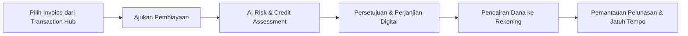

# Business Context: Credor

> **Unit**: Keuangan & Risiko (Finance & Risk Mitigation)  
> **Parent Platform**: Achilles ([achilles.id](https://achilles.id))  
> **Target Audience**: CFOs, Treasury Heads, Credit/Risk Officers, SMEs & Corporate Borrowers seeking liquidity and partner risk insights.

---

## 1. Product Purpose & Value Proposition
Credor adalah platform solusi pembiayaan modal kerja bisnis dan mitigasi risiko mitra berbasis kecerdasan buatan (AI). Credor membantu bisnis meningkatkan arus kas (likuiditas) melalui pendanaan berbasis transaksi riil (seperti invoice financing) serta menyediakan skor risiko kredit mitra untuk pengambilan keputusan bisnis yang aman.

---

## 2. Core Personas

| Persona | Primary Goal | Critical Constraints |
| :--- | :--- | :--- |
| **Business Owner / CFO** | Mempercepat konversi piutang (invoice) menjadi modal kerja cair untuk operasional | Butuh proses pengajuan cepat, biaya transparan, tanpa jaminan aset tetap (*collateral-free*). |
| **Treasury & Finance Head** | Memantau limit pembiayaan yang aktif, jadwal jatuh tempo, dan arus kas pembayaran | Memerlukan rincian biaya bunga/ujrah, tanggal jatuh tempo yang tegas, dan status pencairan *real-time*. |
| **Credit & Risk Analyst** | Menilai kelayakan kredit dan risiko *default* dari mitra dagang sebelum memberikan termin pembayaran | Membutuhkan data historis transaksi riil, skor AI objektif, dan sinyal peringatan dini (*early warning indicators*). |

---

## 3. Core Flows

1. **Pengajuan Pembiayaan Invoice (Invoice Financing)**:
   - Memilih invoice yang sudah terverifikasi di Achilles Transaction Hub.
   - Mengunggah dokumen pendukung (PO, Berita Acara Serah Terima, Rekening Koran).
   - Pemilihan tenor pembiayaan (misal: 30, 60, atau 90 hari).

2. **Penilaian Risiko & Skor Bisnis Mitra (AI Risk Assessment)**:
   - Pencarian profil mitra bisnis berdasarkan NPWP atau nama perusahaan.
   - Tampilan dasbor skor risiko (Rendah, Sedang, Tinggi) berdasarkan performa pembayaran historis.
   - Rekomendasi limit kredit yang aman untuk diberikan ke mitra tersebut.

3. **Pencairan & Monitoring Pelunasan**:
   - Tanda tangan perjanjian pembiayaan digital via Achilles Document Hub.
   - Notifikasi pencairan dana ke rekening terdaftar.
   - Pengingat otomatis menjelang tanggal jatuh tempo pelunasan.

---

## 4. UI Copy, Terminology & Action Verbs

| Gunakan (Approved) | Jangan Gunakan (Forbidden) | Konteks |
| :--- | :--- | :--- |
| **Ajukan Pembiayaan** | Pinjam Uang / Minta Dana | Tombol CTA utama pengajuan fasilitas |
| **Pencairan Dana** | Transfer Duit | Status dana ditransfer ke peminjam |
| **Skor Risiko Bisnis** | Rating Mitra | Penilaian kelayakan kredit mitra AI |
| **Limit Tersedia** | Sisa Plafon | Kapasitas pendanaan yang bisa ditarik |
| **Jatuh Tempo** | Tanggal Akhir / Deadline | Batas akhir pengembalian dana |
| **Biaya Layanan / Bunga** | Potongan | Struktur biaya pembiayaan transparan |
| **Pelunasan** | Pembayaran Balik | Pengembalian dana pokok + imbal hasil |

---

## 5. Compliance & Financial Guardrails

- **Kepatuhan Regulasi Finansial**: Layanan pembiayaan wajib mencantumkan status perizinan mitra lembaga jasa keuangan / perbankan yang bekerja sama dan diawasi oleh OJK (Otoritas Jasa Keuangan).
- **Larangan Janji Palsu (*No False Promises*)**: Dilarang menggunakan kata-kata marketing agresif seperti: *"Pasti Disetujui 100%"*, *"Cair 5 Menit Tanpa Syarat"*, atau *"Pinjaman Tanpa Bunga"*.
- **Transparansi Biaya Mutlak**: Seluruh estimasi suku bunga, biaya provisi/layanan, dan denda keterlambatan wajib ditampilkan secara eksplisit sebelum pengguna mengonfirmasi pengajuan.
- **Persetujuan Akses Data (Consent)**: Pengambilan data finansial mitra wajib disertai checkbox persetujuan syarat & ketentuan yang tidak boleh *pre-checked* secara default.
